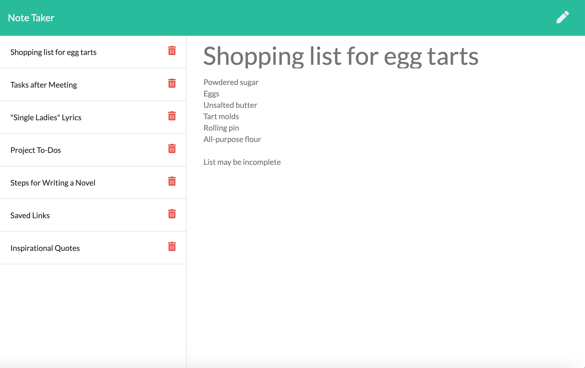

# Note Taker

For those that stress organization in the workforce or in life, this app allows the user to save and delete any notes and information in one location. 

## User Story

AS A user, I want to be able to write and save notes  
I WANT to be able to delete notes I've written before  
SO THAT I can organize my thoughts and keep track of tasks I need to complete

## Description of Design

The overall design of the project is as follows:
1) Utilized Express and other NPM packages to form backend
2) Created CRUD methods (GET, POST, DELETE) to connect frontend with backend
3) Distinguished between HTML and API routes for creating CRUD methods

## Reflection

Though I was only tasked with creating the backend, I have learned a great deal about organizing my code, and seeing how the backend communicates with the frontend to create a sustainable web application.

Access the project on Heroku [here](https://gentle-plateau-55280.herokuapp.com/).